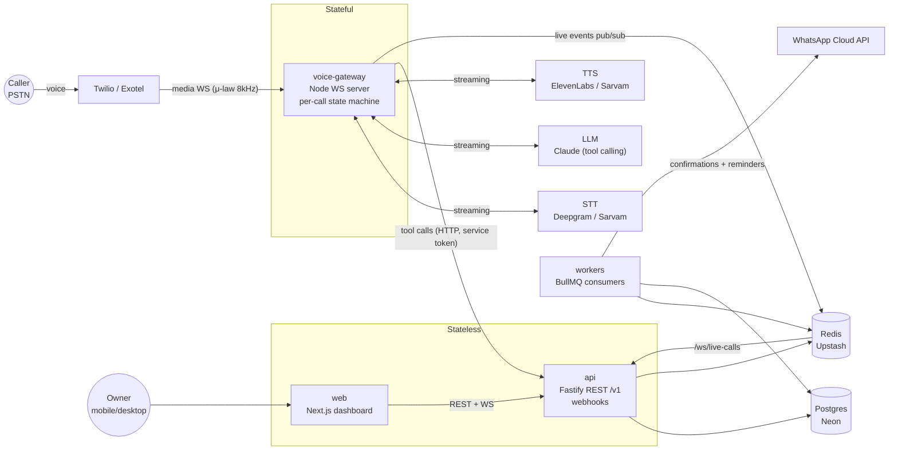
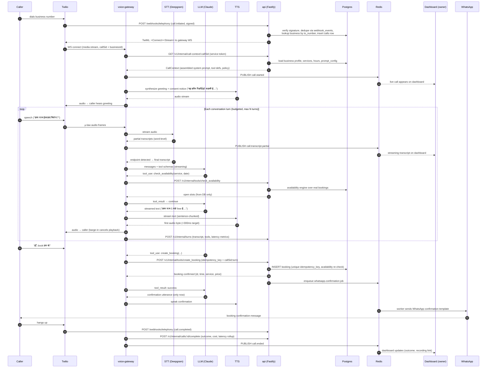

# VaaniDesk — System Architecture

VaaniDesk is an AI voice receptionist for Indian service SMBs. A business forwards (or provisions)
a phone number; VaaniDesk answers in Hindi/Hinglish/English, checks real availability, books
appointments, sends WhatsApp confirmations, and streams everything to a live owner dashboard.

## 1. Topology

Two runtime services plus workers, deliberately split by state profile:



### Why two services (summary — full rationale in ADR-0002)

- **voice-gateway is stateful**: it holds a persistent media WebSocket per call, an in-memory
  per-call state machine (audio buffers, partial transcripts, turn budget, barge-in state), and
  must make sub-100ms scheduling decisions. It cannot be serverless and must not be redeployed
  casually mid-call.
- **api + web are stateless**: standard request/response, horizontally scalable, safe to deploy
  continuously. All durable writes go through the api's data-access layer, so tenant isolation
  and guardrails ("prices/slots only from DB") live in exactly one place.
- **Redis bridges them**: the gateway publishes `call.*` events (started, partial transcript,
  turn completed, ended) to Redis pub/sub; the api fans them out to dashboard WebSocket clients.
  BullMQ (same Redis) carries deferred work: WhatsApp sends, reminders, webhook processing.

## 2. One full call — sequence diagram

The contract this diagram encodes: **a booking is only ever spoken as confirmed after
`create_booking` returns success from Postgres.** The agent never invents prices, slots, or
confirmations; every number it speaks came out of a tool result.



Failure paths (each has an explicit state-machine transition in the gateway):

- **STT/LLM/TTS provider error or timeout** → one retry where safe → apologize + offer owner
  transfer (`<Dial>` to owner_phone) → outcome `transferred`.
- **Turn budget exceeded / caller asks for human / abuse detected** → immediate transfer path.
- **Tool failure (e.g. slot taken between check and create)** → LLM receives structured error and
  re-negotiates ("वो slot अभी book हो गया, 5:30 चलेगा?") — never a fake confirmation.
- **Gateway crash mid-call** → Twilio status callback fires `call.completed`; api reconciles the
  orphaned `calls` row via the webhook path (outcome `failed`), so the dashboard never shows a
  zombie live call.

## 3. Monorepo layout

```
vaanidesk/
├── apps/
│   ├── web/              # Next.js 15 App Router — dashboard + onboarding (stateless)
│   ├── api/              # Fastify REST /v1 + webhooks + /ws/live-calls (stateless)
│   ├── voice-gateway/    # Node WS media server — per-call state machine (stateful)
│   └── workers/          # BullMQ consumers: WhatsApp sends, reminders, reconciliation
├── packages/
│   ├── shared/           # Result type, error taxonomy, env parsing, time/tz, phone, pagination
│   ├── core/             # Pure domain logic: availability engine, booking rules (no I/O)
│   ├── db/               # Drizzle schema + migrations + tenant-scoped data-access layer
│   ├── agent/            # Prompt assembly, tool JSON schemas, guardrails, cost accounting
│   └── evals/            # 30-scenario eval harness: scripted callers, judge, CI gate
├── docs/
│   ├── adr/              # Architecture decision records
│   ├── architecture.md   # This file
│   └── latency-budget.md # Per-stage latency targets and measurement points
├── docker-compose.yml    # Local Postgres + Redis
└── turbo.json / pnpm-workspace.yaml
```

Dependency rule (enforced by review + lint):
`shared ← core ← db ← agent ← {api, voice-gateway, workers, web}` — arrows point at dependents.
`core` is pure (no I/O, no Drizzle imports) so the availability engine is trivially unit-testable.
Apps never import each other; they talk over HTTP/Redis.

## 4. Multi-tenancy

Every tenant-owned table carries `business_id`. Isolation is enforced in the data-access layer
(`packages/db/src/dal`): repositories are constructed _for_ a business
(`dal.forBusiness(businessId)`) and it is impossible to express a cross-tenant query through
them. Routes never hand-write `where business_id = ?`. Details in ADR-0003.

## 5. Deployment

| Component     | Platform                   | Notes                                                                            |
| ------------- | -------------------------- | -------------------------------------------------------------------------------- |
| web           | Vercel                     | RSC, edge-cached static, preview deploys per PR                                  |
| api           | Railway/Fly                | stateless, N replicas behind LB                                                  |
| voice-gateway | Railway/Fly                | fewer, larger instances; sticky by call (one WS = one call); drain before deploy |
| workers       | Railway/Fly                | BullMQ concurrency-tuned                                                         |
| Postgres      | Neon                       | branches for preview envs                                                        |
| Redis         | Upstash                    | pub/sub + BullMQ                                                                 |
| Recordings    | S3-compatible (ap-south-1) | private bucket, signed URLs only                                                 |

Environments: `dev` (docker-compose) → `preview` (per-PR, Neon branch) → `prod`. Separate keys
per environment; secrets only via platform env vars.
